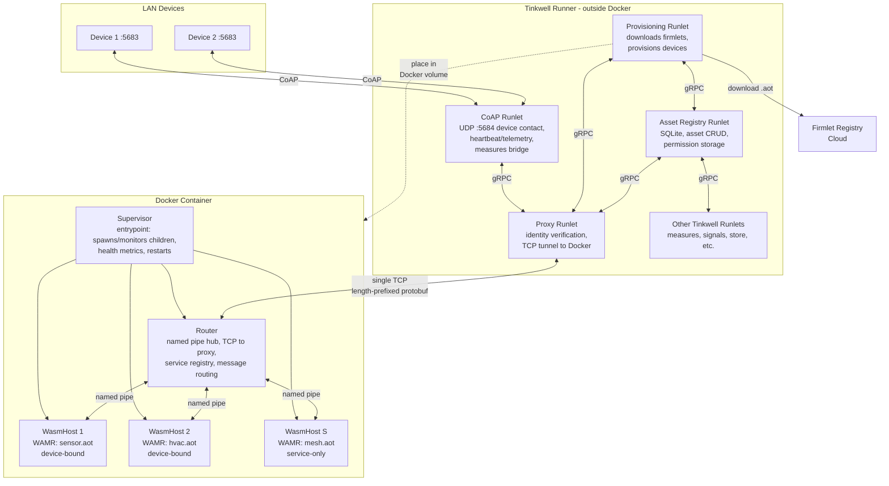
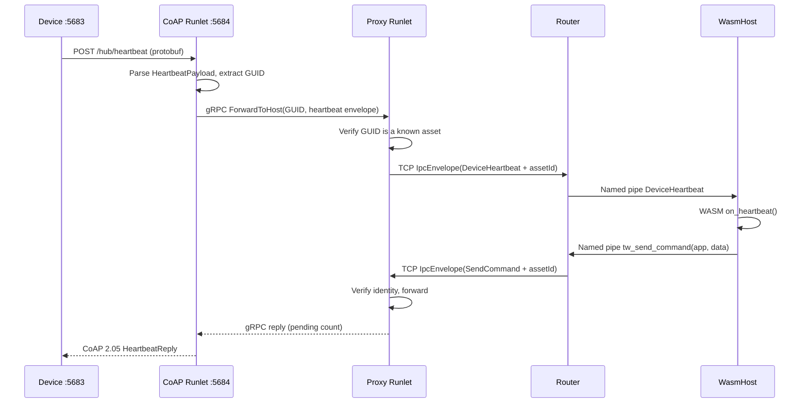
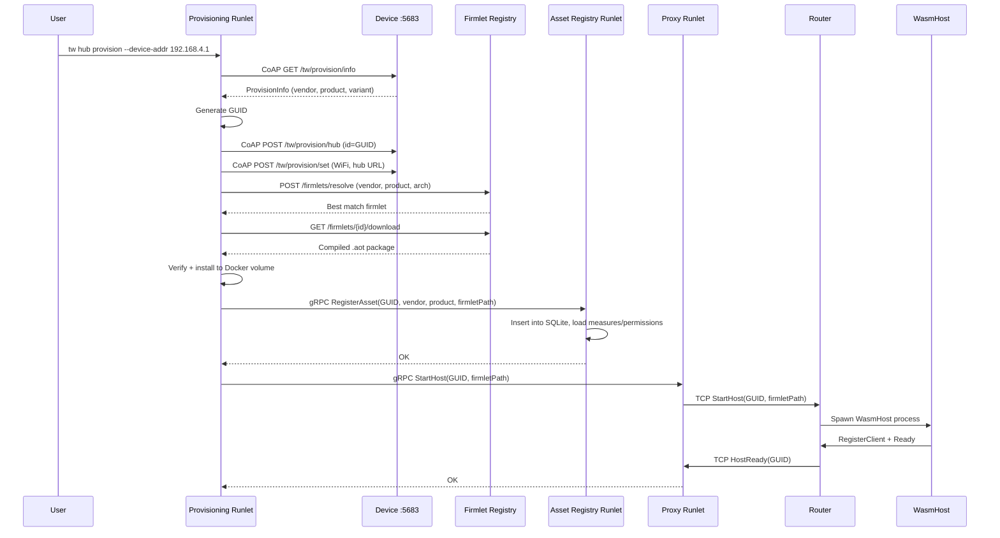
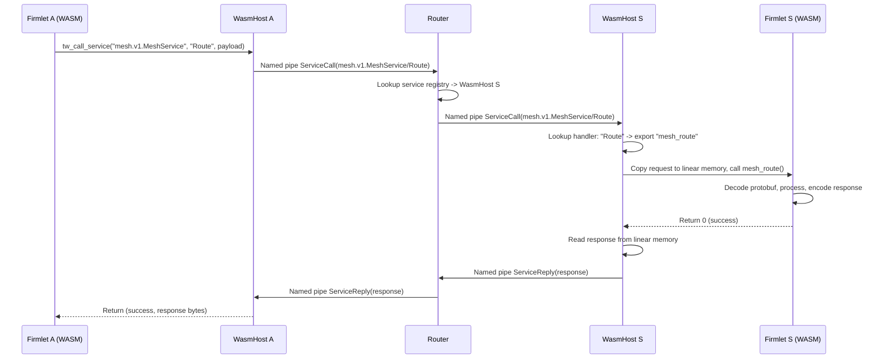
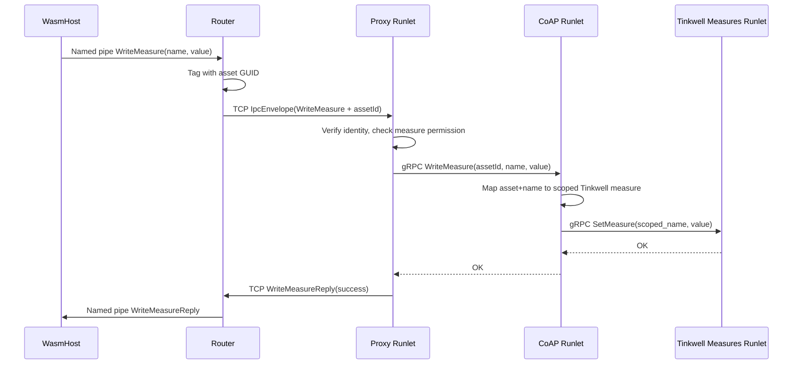
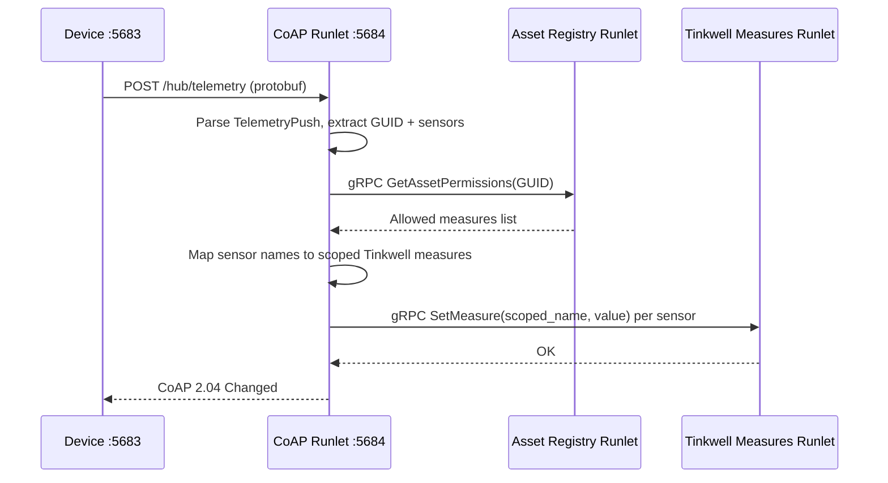
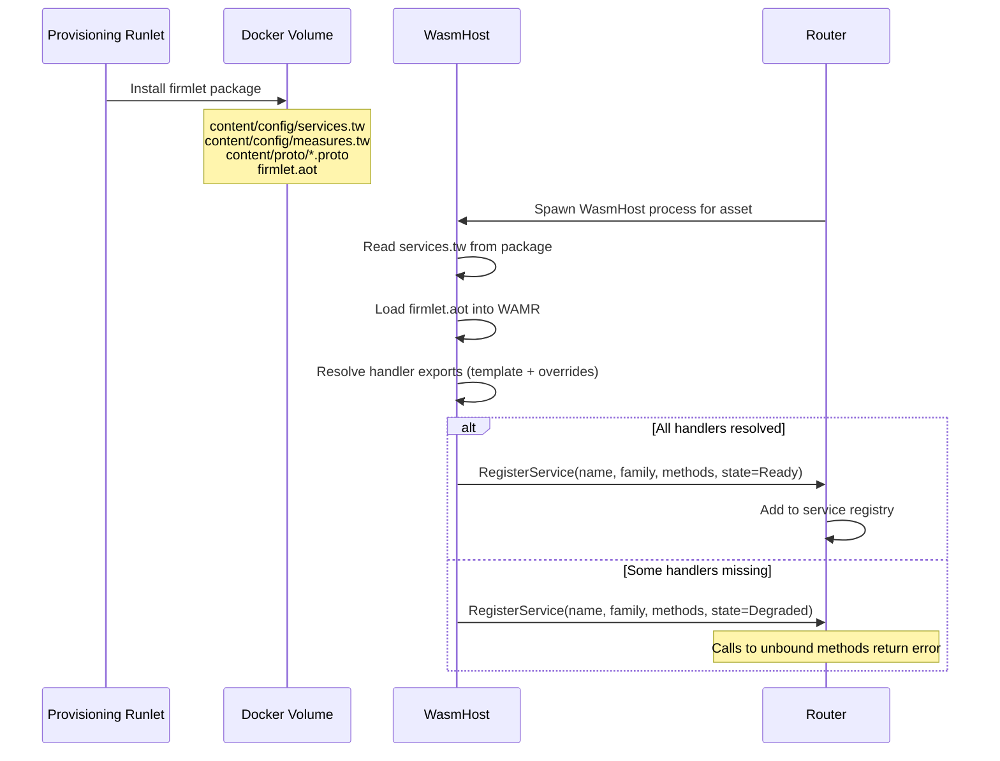

# Firmwareless Hub -- Architecture

## Overview

The firmwareless hub runs WASM firmlets that manage physical devices on the local network.
It is split into two layers:

- **Inside Docker** -- a **Supervisor** (container entrypoint), a **Router** (named-pipe hub and TCP bridge to the proxy runlet), and per-asset **WasmHost** processes, fully isolated from the network
- **Outside Docker** -- four Tinkwell runlets that integrate with the standard Tinkwell runner



## Components

### Process Separation (Supervisor + Router)

Inside the Docker container, the hosting stack is split into:

- **Supervisor** (entrypoint): Spawns and monitors all child processes.
  Collects health metrics.
  Manages process restarts with sigmoid-backoff circuit breaker.
  If Router dies, restarts it.
  If Router fails repeatedly, self-terminates (Docker restarts container).

- **Router** (spawned by Supervisor): Named-pipe hub for WasmHost connections.
  Service registry.
  Message routing between WasmHosts and TCP bridge to Proxy Runlet.
  Forwards Suspend/Resume commands.
  Sends heartbeats to Supervisor.

- **WasmHost** (one per asset): WAMR runtime for a single firmlet.
  Connects to Router via named pipe.
  Handles lifecycle transitions.

Mutual health checks:

- Supervisor monitors Router via heartbeat pipe (kills/restarts if heartbeat stops)
- Router holds sentinel pipe to Supervisor (if it breaks, Router self-terminates)

### Inside Docker

**Supervisor** (`Tinkwell.Firmwareless.Hosting.Supervisor`)

- Container entrypoint: spawns the Router and WasmHost processes, monitors child health, and applies restart policy (sigmoid-backoff circuit breaker; repeated Router failure leads to Supervisor exit so Docker can restart the container)
- Collects per-process metrics for **Health Monitoring** (see below)

**Router** (`Tinkwell.Firmwareless.Hosting.Router`)

- **TCP server** on a known port -- accepts one persistent bidirectional connection from the proxy runlet, using the same length-prefixed protobuf framing as named pipes
- **Named pipe hub** -- spawns/manages one WasmHost per asset, routes IPC messages between them
- **Service registry** -- tracks which WasmHost handles which service (full name + family name)
- **Message routing** -- inter-firmlet calls that stay inside Docker are routed pipe-to-pipe; calls targeting the outside world (measures, Tinkwell services) go out over TCP
- **Identity tagging** -- every outbound TCP message includes the asset GUID so the proxy runlet can enforce permissions
- **Lifecycle commands** -- receives start/stop asset commands from the proxy runlet over TCP; forwards Suspend/Resume as appropriate
- **Heartbeats** -- sends heartbeats to Supervisor on the heartbeat pipe; holds sentinel pipe to Supervisor

No internet access, no registry client, no CoAP, no SQLite.
Pure process orchestration (Supervisor) and message routing (Router).

**WasmHost** (`Tinkwell.Firmwareless.Hosting.WasmHost`)

- One per asset, communicates with Router via named pipes
- Reads `content/config/services.tw` from the firmlet package at startup
- Loads `.aot` modules into WAMR, resolves handler exports by name (template expansion + overrides)
- Registers resolved services with the Router (including per-method binding status)
- Dispatches incoming `ServiceCall` messages to the appropriate WASM export
- Exports host functions to WASM (abort, tw_log, tw_send_command, tw_call_service, `tw_write_measure_float`, `tw_write_measure_quantity`, etc.)

### Outside Docker (Tinkwell Runlets)

**Proxy Runlet** (`Tinkwell.Runlet.Firmwareless.Proxy`) -- identity and tunneling

- Runs inside the standard Tinkwell gRPC runner
- **TCP client** -- persistent connection to the Router inside Docker
- **Identity verification** -- validates asset GUIDs on packets crossing the Docker boundary.
  Checks that the asset exists (queries asset registry) and that the claimed identity matches the host that sent it
- **gRPC service** -- thin tunnel API: `ForwardToHost(assetId, envelope)`, `ForwardFromHost(stream)`, `StartHost(assetId, firmletPath)`, `StopHost(assetId)`.
  Other runlets call this to reach the Router
- **No database, no business logic** -- purely a verified passthrough.
  Everything it needs to validate comes from querying the asset registry runlet via gRPC

**Asset Registry Runlet** (`Tinkwell.Runlet.Firmwareless.AssetRegistry`) -- source of truth

- **SQLite** -- asset database: GUID, vendor, product, variant, firmlet assignment, communication mode, state, permissions
- **gRPC service** -- asset CRUD: `RegisterAsset`, `RemoveAsset`, `GetAsset`, `ListAssets`, `UpdateAssetState`; permission queries: `GetAssetPermissions`
- **Permission storage** -- loads `measures.tw` and `permissions.tw` from firmlet packages at registration time; stores what each asset is allowed to do.
  Does **not** enforce -- callers query and enforce locally
- **Initialized-once flag** -- stored per asset; set after first successful START completion; reset on firmlet version update (see **Firmlet Lifecycle**)
- Other runlets query this for asset lookups and permission data

**CoAP Runlet** (`Tinkwell.Runlet.Firmwareless.CoAP`) -- device contact point and measures bridge

- Standard Tinkwell CoAP server on UDP 5684
- Receives `POST /hub/heartbeat` and `POST /hub/telemetry` from devices
- **Device identity verification** -- validates the calling device's identity (GUID, vendor, product) against the asset registry before processing any request
- Parses `HeartbeatPayload` / `TelemetryPush` protobuf (from `tw_protocol.proto`)
- Calls the proxy runlet's gRPC service to forward device data to the correct firmlet inside Docker
- **Measures bridge** -- maps device identity + sensor names to scoped Tinkwell measure names; writes sensor readings to the Tinkwell measures gRPC service.
  Queries asset registry for the mapping and enforces declared measure permissions

**Provisioning Runlet** (`Tinkwell.Runlet.Firmwareless.Provisioning`) -- install and provision

- Handles new device onboarding and removal
- **Registry client** -- uses `Tinkwell.Firmlets.Registry.Client` for firmlet resolution and download
- **Firmlet installer** -- downloads .aot packages, verifies signatures (`Tinkwell.Package`), places them in the shared Docker volume
- **Device provisioning** -- CoAP calls to factory-fresh devices (assign GUID, configure WiFi/hub URL)
- Calls the **asset registry** runlet's gRPC service: `RegisterAsset(id, vendor, product, firmletPath, ...)`
- Calls the **proxy** runlet's gRPC service: `StartHost(id, firmletPath)` / `StopHost(id)`
- CLI integration via `Tinkwell.Cli.Commands.Hub` (Spectre.Console.Cli extension): `tw hub provision` (CoAP device discovery), `tw hub add` (register + start host), `tw hub remove` (stop + unregister)

## Runtime details

### Firmlet Lifecycle

Single callback: `tw_on_lifecycle(event, reason)`

**Events:** `INITIALIZE` (0), `START` (1), `STOP` (2)

**Reasons:** `START` (0), `FIRST_TIME_SETUP` (1), `RESTART` (2), `RESUME` (3), `SUSPEND` (4), `UNINSTALLING` (5), `QUIT` (6), `TERMINATING` (7)

**State machine:** `Loading` → `Initialized` → `Running` → `Suspended` (on `STOP` with `SUSPEND`) → `Initialized` (on resume) → `Running`

- Alternatively from `Running` or as applicable: → `Stopped` (on `STOP` with `QUIT` | `UNINSTALLING` | `TERMINATING`)

**Initialized once** flag stored in Asset Registry.
Set to `true` after first successful START completion.
Reset on firmlet version update.

**Sequences:**

| Scenario | Sequence |
|----------|----------|
| First ever run | `INITIALIZE(FIRST_TIME_SETUP)` → `START(START)` |
| Normal start | `INITIALIZE(START)` → `START(START)` |
| Restart | `INITIALIZE(START)` → `START(RESTART)` |
| Resume | `INITIALIZE(START)` → `START(RESUME)` |
| Suspend | `STOP(SUSPEND)` |

### Measures API

**Host functions:**

- `tw_write_measure_float(name, value)` -- raw numeric, no conversion
- `tw_write_measure_quantity(name, quantity_str)` -- string like `"25.3 DegreesCelsius"`, resolved via Quant

**Built-in service** `tinkwell.hub.v1.MeasuresService`:

- `WriteMeasure`, `ReadMeasure`, `ListMeasures`, `GetDefinition`
- Handled locally in WasmHost (reads and definitions) or forwarded via IPC (writes)
- Firmlets call via `tw_call_service`; proto defined in `firmwareless_measures.proto`

### Health Monitoring

Flow: Supervisor collects per-process metrics (CPU, memory, threads) → **HealthSnapshot** IPC to Router → Router forwards to Proxy via TCP → Proxy writes to state store `_health` bucket → visible via `tw runners health`.

**HealthSnapshot** includes per-host reports plus a router report with: `asset_id`, firmlet state, CPU%, memory, thread count, status, uptime, restart count, service states.

### Docker Resource Limits

CPU and memory quotas are managed via `docker-compose.yml`.
The container uses a read-only root filesystem, dropped capabilities, `tmpfs` for `/tmp`, and an internal-only network.
**Service calls** use a **120-second** system timeout (see **Timeouts** under Service Registration).

## Runlet Responsibility Matrix

| Concern                       | Proxy | Asset Registry | CoAP | Provisioning |
| ----------------------------- | ----- | -------------- | ---- | ------------ |
| TCP tunnel to Docker          | x     |                |      |              |
| Identity verification         | x     |                | x    |              |
| Permission enforcement        | x     |                | x    |              |
| SQLite asset DB               |       | x              |      |              |
| Permission storage            |       | x              |      |              |
| Tinkwell measure bridge       |       |                | x    |              |
| Device heartbeat/telemetry    |       |                | x    |              |
| Firmlet resolution + download |       |                |      | x            |
| Device provisioning (CoAP)    |       |                |      | x            |
| CLI commands (tw hub ...)     |       |                |      | x (Cli.Commands.Hub) |
| Asset CRUD (gRPC)             |       | x              |      |              |
| StartHost / StopHost          | x     |                |      |              |

## Key Flows

### Flow 1: Device Heartbeat



### Flow 2: New Device Provisioning



### Flow 3: Inter-Firmlet Service Call (inside Docker)



### Flow 4: Firmlet Writes a Measure (crosses Docker boundary)



### Flow 5: Device Telemetry Bridged to Measures (CoAP runlet direct)



## Service Registration

Services are defined **declaratively** in `content/config/services.tw` inside the firmlet package.
The WASM code never calls a registration function -- it only needs to export handler functions with the right names.
The WasmHost reads `services.tw`, resolves each method to an exported WASM function, registers the services with the Router, and dispatches incoming calls automatically.

This separation keeps the service definition immutable and independent of the firmlet's runtime lifecycle: the same metadata survives unloads, restarts, or (in future) migration between containers.

### services.tw syntax

```tw
service "mesh.v1.MeshService" {
    module="mesh-bridge"
    family="MeshRouting"
    description="Routes mesh network messages between devices"
    handler="mesh_{name:lowercase}"

    depends_on "device.v1.DeviceService"

    method Route;
    method Discover;
    method LegacyPing handler="do_ping";
}

service "analytics.v1.AnalyticsService" {
    module="analytics"
    load="on-demand"
    family="Analytics"
    handler="analytics_{name:lowercase}"

    method Aggregate;
    method Summarize;
}
```

| Element | Description |
|---------|-------------|
| `service "full.Name"` | Block declaring a service. The name is the full protobuf-style service name. |
| `module` | Name of the `.aot` module (without extension) that contains the handlers. Required when the firmlet package has multiple modules. |
| `load` | Module load policy: `"startup"` (default) or `"on-demand"`. On-demand modules are loaded when the first service call arrives and stay loaded until the host terminates. |
| `family` | Short logical family name used for `tw_call_service_by_family`. |
| `description` | Human-readable description (advisory, for tooling and documentation). |
| `handler` (service-level) | Template that derives the WASM export name for each method. |
| `depends_on` | Advisory dependency on another service (not enforced at startup). |
| `method Name` | Declares a method. Quotes around the name are optional. |
| `handler` (method-level) | Explicit WASM export name, overrides the service-level template. |

A single `services.tw` file may declare multiple services.
Each service maps to exactly one `.aot` module; multiple services may share the same module.

### Module loading

A firmlet package can contain multiple `.aot` modules under `content/`.
Each service declaration names its module via the `module` property.
The WasmHost uses the `load` property to determine when to instantiate it:

| `load` value | Behavior |
|---|---|
| `"startup"` (default) | Module is loaded and instantiated during WasmHost startup. The service is immediately ready for calls. |
| `"on-demand"` | Module is **not** loaded at startup. It is loaded on the first incoming service call. The service is registered as `Defined` until that first call triggers loading, after which it becomes `Ready`. |

Once loaded, a module stays loaded for the lifetime of the WasmHost process.
There is no unloading -- if a service is no longer needed, the entire WasmHost process is terminated.

### Handler resolution

Each method must resolve to a named WASM export.
Resolution order:

1. **Method-level `handler`** -- if the method has an explicit `handler="fn_name"`, use that.
2. **Service-level `handler` template** -- expand the template with the method name.

At least one of these must be present for every method.
If neither is set, the WasmHost reports an error at startup and the service stays in `Defined` state.

### Handler template

The service-level `handler` property is a pseudo-template.
A small fixed set of variables is expanded at load time:

| Variable | Value | Example |
|----------|-------|---------|
| `{name}` | The method name | `Route` |
| `{service}` | The full service name | `mesh.v1.MeshService` |
| `{family}` | The family name | `MeshRouting` |
| `{module}` | The module name | `mesh-bridge` |

Each variable supports a format modifier after a colon:

| Modifier | Effect | Example (`{name:...}` for `Route`) |
|----------|--------|------|
| `:lowercase` | All lower-case | `route` |
| `:uppercase` | All upper-case | `ROUTE` |
| `:pascalcase` | PascalCase (identity for single words) | `Route` |

Given `handler="mesh_{name:lowercase}"`:
- Method `Route` resolves to export `mesh_route`
- Method `Discover` resolves to export `mesh_discover`
- Method `LegacyPing` is overridden by its own `handler="do_ping"`

### Handler function signature

All handlers use the same standard signature (payloads are always protobuf):

```c
int32_t handler(const uint8_t* request, uint32_t request_len,
                uint8_t* response, uint32_t* response_capacity);
```

- `request` / `request_len` -- pointer to and length of the incoming protobuf payload in WASM linear memory (read-only).
- `response` / `response_capacity` -- pointer to a pre-allocated response buffer in WASM linear memory.
  On entry `*response_capacity` is the buffer size; on return the handler writes the actual response length back into `*response_capacity`.
- Return value -- `0` for success, negative values are error codes.

### Example: C firmlet with nanopb

The firmlet exports its handler functions.
No init code is required for service registration; `services.tw` takes care of that.

```c
#include "mesh.pb.h"

__attribute__((export_name("mesh_route")))
int32_t mesh_route(const uint8_t* req, uint32_t req_len,
                   uint8_t* resp, uint32_t* resp_cap) {
    RouteRequest request = RouteRequest_init_zero;
    pb_istream_t in = pb_istream_from_buffer(req, req_len);
    if (!pb_decode(&in, RouteRequest_fields, &request))
        return -1;

    RouteResponse response = { .status = 0 };
    pb_ostream_t out = pb_ostream_from_buffer(resp, *resp_cap);
    if (!pb_encode(&out, RouteResponse_fields, &response))
        return -2;

    *resp_cap = out.bytes_written;
    return 0;
}

__attribute__((export_name("mesh_discover")))
int32_t mesh_discover(const uint8_t* req, uint32_t req_len,
                      uint8_t* resp, uint32_t* resp_cap) {
    /* ... */
    return 0;
}

__attribute__((export_name("do_ping")))
int32_t do_ping(const uint8_t* req, uint32_t req_len,
                uint8_t* resp, uint32_t* resp_cap) {
    /* legacy handler with non-standard name */
    return 0;
}
```

### Protobuf toolchain

Payloads are always protobuf-serialized.
The `.proto` files ship inside the firmlet package (alongside `services.tw`) so callers know the contract.
Message types are generated from `.proto` at firmlet build time using the appropriate toolchain:

- **C** -- nanopb (same as the device SDK)
- **AssemblyScript** -- as-proto or similar
- **Rust** -- prost

Only the payload types (messages) need code generation.
The handler functions and their exports are written by the firmlet developer.

### Registration flow



### Service states

| State | Meaning |
|-------|---------|
| **Defined** | `services.tw` parsed but no handler could be resolved (e.g. WASM module not yet loaded, or export not found). Calls return "service unavailable". |
| **Ready** | All declared methods have resolved WASM exports. Service is fully operational. |
| **Degraded** | Some methods resolved, some did not. Resolved methods work; unresolved methods return "handler not bound". |
| **Unavailable** | Firmlet was unloaded or crashed. Definition persists in the registry; calls return "service unavailable". |

### Dispatch

When the Router routes a `ServiceCall` to a WasmHost:

1. WasmHost looks up the handler for the requested method (service + method -> WASM export name).
2. If the handler is not bound, returns a `ServiceReply` with `error = "handler not bound"`.
3. Allocates a request buffer in WASM linear memory and copies the protobuf payload.
4. Allocates a response buffer in WASM linear memory.
5. Calls the handler via `wasm_runtime_lookup_function` + `wasm_runtime_call_wasm`.
6. Reads the response from WASM linear memory.
7. Sends `ServiceReply` back to the Router via named pipe.

### Timeouts

- **System timeout** -- 120 seconds by default, aligned with **Docker Resource Limits** and hosting configuration.
  This is a hard ceiling enforced by the WasmHost: if the WASM handler does not return within this time, the call is aborted and a timeout error is returned to the caller.
- **Caller timeouts** -- individual callers (via `tw_call_service`) may specify shorter timeouts.
  The system timeout is the upper bound regardless.

### Error handling summary

| Condition | Behavior |
|-----------|----------|
| Service declared, all handlers resolved | State = Ready, fully operational |
| Service declared, some handlers missing exports | State = Degraded, unbound methods return error |
| Service declared, no handlers resolved | State = Defined, all calls return "service unavailable" |
| `ServiceCall` for undeclared service | Router returns "service not found" |
| `ServiceCall` for undeclared method | WasmHost returns "method not found" |
| Handler exceeds system timeout (120s) | WasmHost aborts call, returns timeout error |
| Firmlet crashes or is unloaded | State = Unavailable, definition persists |

### Scope

Service registrations are **internal to the Docker container**.
Only other firmlets running inside the same container can discover and call them (via `tw_call_service`, `tw_call_service_by_family`, `tw_find_service`, etc.).
Services are not propagated outside Docker.

### Firmlet package layout

```
firmlet-package/
  firmlet.aot                        # AoT-compiled WASM module
  content/
    config/
      services.tw                    # Service declarations + handler bindings
      measures.tw                    # Declares measures the firmlet may write
      permissions.tw                 # Declares permissions the firmlet requires
    proto/
      mesh.proto                     # Service contract (for callers)
```

All config files are optional. The only required file is `firmlet.aot`.

| File | Read by | Purpose |
|------|---------|---------|
| `content/config/services.tw` | WasmHost | Service + method declarations, handler bindings |
| `content/config/measures.tw` | Asset Registry | Declares measures the firmlet may write |
| `content/config/permissions.tw` | Asset Registry | Declares permissions the firmlet requires |
| `content/proto/*.proto` | Callers (build-time) | Protobuf service contracts for inter-firmlet calls |
