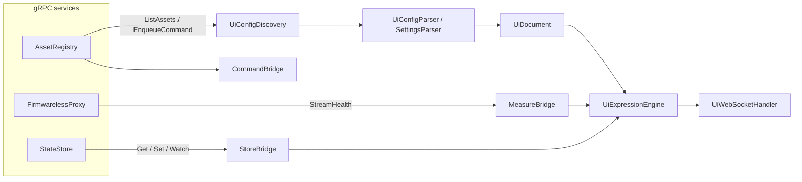
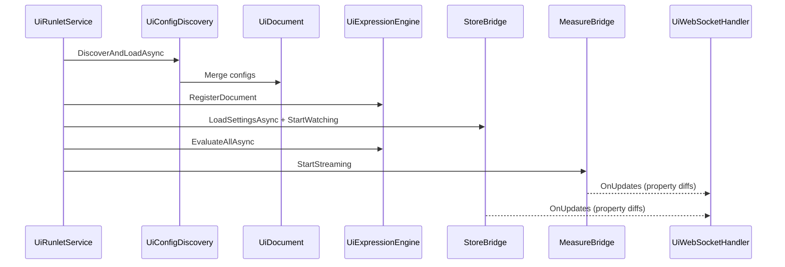

# Hub UI architecture

The Hub UI is an ASP.NET Core host that loads `.tw` UI and settings definitions, evaluates NCalc expressions against live measure and setting values, and exposes a JSON tree plus a WebSocket channel for incremental updates.
A separate React SPA (built into `wwwroot`) renders the tree.

## Deployment modes

**Standalone (current):** `dotnet run` on the `Tinkwell.Firmwareless.Hub.Ui` project starts Kestrel, static files, REST endpoints, and WebSockets.
Bridge addresses come from `appsettings.json` or environment variables.

**Runlet (future):** The same assembly is intended to run inside a Tinkwell runner with injected bridge endpoints from coordinator configuration instead of standalone defaults.

## High-level flow

At startup, `UiRunletService` discovers assets, merges `UiDocument` instances, registers expressions, loads settings per asset from StateStore, evaluates all expressions once, then subscribes bridges to push `PropertyUpdate` lists to the WebSocket handler.

## gRPC bridges

| Bridge | Service | Role |
|--------|---------|------|
| `MeasureBridge` | FirmwarelessProxy (`Bridge:ProxyAddress`) | Subscribes to `StreamHealth`. For each host snapshot, pushes `health-status`, `cpu-percent`, and `working-set-bytes` into the expression engine per `AssetId`. |
| `StoreBridge` | StateStore (`Bridge:StateStoreAddress`) | Reads and writes settings under `BucketId = assetId`, `KeyNamespace = "settings"`. Watches changes and feeds the expression engine. |
| `CommandBridge` | AssetRegistry (`Bridge:AssetRegistryAddress`) | Sends `EnqueueCommand` when the UI issues a button `action` with a `command` type. |

## AssetRegistry and config discovery

`UiConfigDiscovery` lists assets via `ListAssets`, then loads `ui.tw` and `settings.tw` per asset.
The in-repo `LoadAssetConfigAsync` path is a placeholder until the registry exposes config file content over gRPC; `LoadFromFilesAsync` is used for tests and future integration.

Merged documents combine groups by name (pages are appended), append widgets, and merge settings by key (`TryAdd`).

## Expression engine

`UiExpressionEngine` uses `Tinkwell.Expressions` (`IExpressionEvaluator`) for NCalc evaluation.
Any property whose `UiPropertyValue` carries an expression (`(...)` in `.tw`) is registered as an `ExpressionBinding`.

Dependency tracking uses a regex over the expression text to collect identifier tokens (excluding keywords such as `true`, `false`, `if`, `and`).
When a variable changes—via `AssetContext.SetValue`—only bindings that list that dependency are re-evaluated.

Dependency keys are scoped per asset: `{assetId}:{variableName}` when an asset id is present.

### Built-in measure names (from StreamHealth)

The health stream maps each host to variables consumed by expressions:

| Variable | Source |
|----------|--------|
| `health-status` | Host status string |
| `cpu-percent` | CPU percentage |
| `working-set-bytes` | Working set (long) |

Setting keys from `settings.tw` match expression identifiers by name (e.g. `setpoint`).

## REST and WebSocket APIs

| Endpoint | Purpose |
|----------|---------|
| `GET /api/ui/tree` | Full resolved UI tree (JSON) |
| `GET /api/ui/theme` | Theme object from the `ui` block |
| `GET /api/ui/widgets` | Widget list for overview |
| `GET /ws` | WebSocket for `update` deltas and `tree` refreshes |

See [websocket-protocol.md](websocket-protocol.md) for message shapes.

## Serialization

`UiTreeSerializer` builds the JSON consumed by the React app. It resolves expression-backed properties to their current values; the browser never receives raw expression strings.

## Startup sequence

